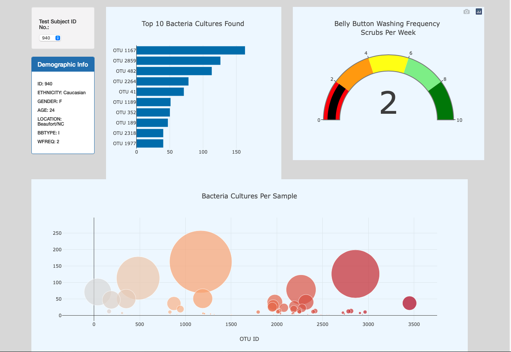

# Belly Button Biodiversity

### Resources

* Data Source: samples.json
* JavaScript's plotly, HTML, D3
 
## Project Overview

in this project we analyze data related to belly button bacterial bidiversity, we create a dashboard that shows demographic information and visualizes the bacterial data for each volunteer. we are also able to identify the top 10 bacterial species in their belly buttons. So, if Improbable Beef identifies a species as a candidate to manufacture synthetic beef, they'll easily be able to identify whether that species is found in their navel.

the dashboard can be viewed at: https://mlachha.github.io/Belly_Button_Biodiversity/
the dashboard looks like : 

